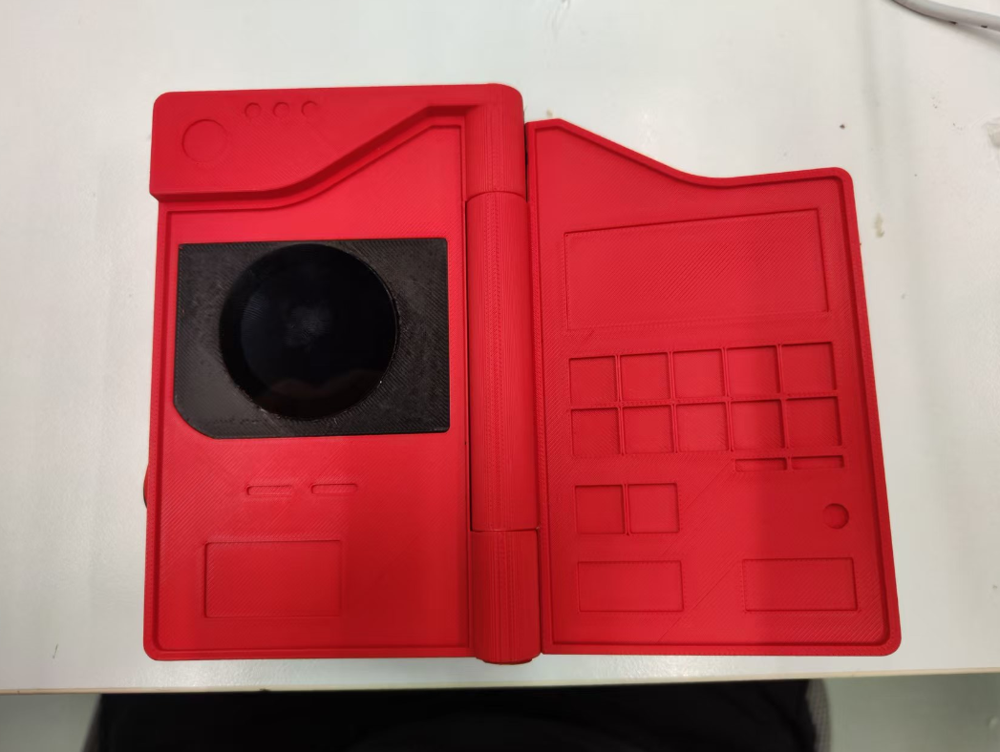

# PokedeZ - 多模态 Pokemon图鉴

*基于ESP32-S3的神奇宝贝图鉴设备*

---

## 📖 项目简介

PokedeZ是一个基于ESP32-S3的神奇宝贝图鉴设备，集成了摄像头拍照、GPT图像识别和语音播报功能。用户可以通过触摸屏幕拍摄神奇宝贝图像，系统会自动识别并显示相关信息，同时通过语音播报介绍该神奇宝贝的特点。

## ✨ 主要功能

### 📸 实时图像预览
- 设备启动后进入全屏实时预览模式
- 通过240x240分辨率的摄像头显示实时画面
- 支持触摸屏交互

### 🤖 触摸拍照与识别
- 触摸屏幕即可拍摄当前画面
- 自动将拍摄的图像发送给GPT进行分析
- GPT识别图像中的神奇宝贝并返回英文名称

### 📊 神奇宝贝信息显示
- 识别成功后显示神奇宝贝的编号、名称
- 展示神奇宝贝的类型（属性）
- 显示HP、攻击力、防御力等基础数值
- 从内置数据库中显示对应的神奇宝贝图像

### 🔊 语音播报功能
- 识别成功后，系统会向LLM询问该神奇宝贝的详细信息
- 获取包括中文名字、特性、分布等在内的简要介绍（不超过60字）
- 通过I2S接口的扬声器播放语音介绍

### 🔄 双模式显示
- **全屏模式**：显示实时摄像头画面
- **分析模式**：显示拍摄结果、神奇宝贝信息和图像
- 通过触摸屏幕可在两种模式间切换

## 🔧 硬件配置

### 核心组件
| 组件 | 型号 |
|------|------|
| **主控芯片** | XIAO ESP32S3 |
| **显示屏** | Seeed Round Display |
| **摄像头** | OV5640 |
| **音频驱动** | MAX98357A |
| **存储** | SPIFFS文件系统 |

### 引脚定义
- 触摸中断引脚：D7
- I2S音频输出引脚：
  - DOUT: D0
  - BCLK: D2
  - LRC: D9

## 💻 软件特性

### 依赖库
- **ArduinoGPTChat**：GPT通信和TTS功能
- **TFT_eSPI**：显示屏驱动
- **ESP32 Camera API**：摄像头控制
- **Audio**：音频播放

### 神奇宝贝数据库
- 内置完整的神奇宝贝数据库
- 包含编号、名称、类型、基础数值等信息
- 存储每个神奇宝贝的图像数据

### 图像处理
- 支持JPEG格式图像存储
- 自动调整图像大小以适应显示需求
- 使用PSRAM进行图像缓冲，提高性能

## 🚀 使用方法

1. **启动设备**：设备上电后自动初始化并连接WiFi
2. **实时预览**：设备进入全屏实时预览模式
3. **拍照识别**：触摸屏幕拍摄当前画面，系统自动识别神奇宝贝
4. **查看信息**：识别结果和神奇宝贝信息会显示在屏幕上
5. **听取介绍**：系统自动播放神奇宝贝的语音介绍
6. **返回预览**：再次触摸屏幕返回实时预览模式，可继续识别其他神奇宝贝

## 🎯 技术亮点

| 特性 | 描述 |
|------|------|
| **AI图像识别** | 利用GPT进行图像识别，准确识别各种神奇宝贝 |
| **语音交互** | 集成TTS功能，提供语音播报体验 |
| **实时显示** | 流畅的实时预览和快速响应 |
| **资源优化** | 合理利用PSRAM和内存资源，确保系统稳定运行 |
| **用户友好** | 简单的触摸操作，适合各年龄段用户 |

## 🛠️ 开发信息

本项目基于Arduino框架开发，充分利用了ESP32-S3的性能和外设资源，实现了神奇宝贝图鉴的核心功能。

---

*Made with ❤️ for Pokémon fans*

