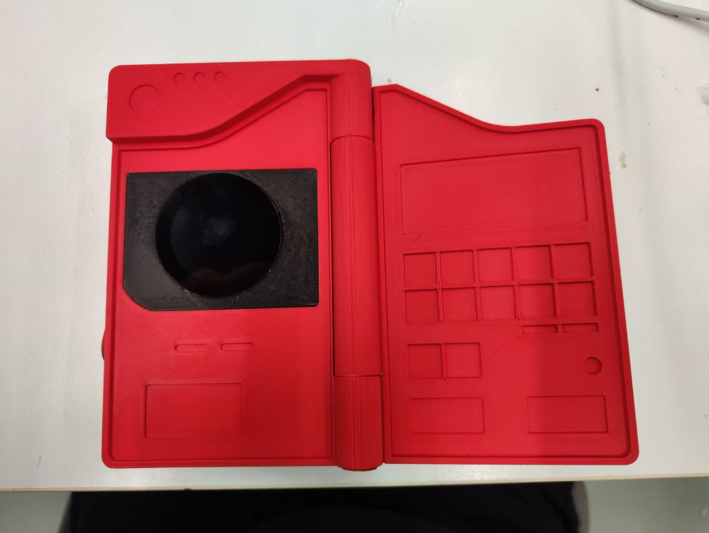

# PokedeZ - Multimodal Pokemon Pokedex

[简体中文](README.md) | English

*A Pokemon Pokedex device based on ESP32-S3*

---

## 📖 Project Introduction

PokedeZ is a Pokemon Pokedex device based on ESP32-S3, integrating camera photography, GPT image recognition, and voice broadcast functions. Users can take Pokemon images by touching the screen, and the system will automatically recognize and display related information while introducing the features of the Pokemon through voice broadcast.

## ✨ Main Features

### 📸 Real-time Image Preview
- The device enters full-screen real-time preview mode after startup
- Display real-time footage through a 240x240 resolution camera
- Support touchscreen interaction

### 🤖 Touch Photography and Recognition
- Touch the screen to take a picture of the current scene
- Automatically send the captured image to GPT for analysis
- GPT recognizes the Pokemon in the image and returns its English name

### 📊 Pokemon Information Display
- After successful recognition, display the Pokemon's number and name
- Show the Pokemon's types (attributes)
- Display basic stats such as HP, Attack, Defense, etc.
- Display the corresponding Pokemon image from the built-in database

### 🔊 Voice Broadcast Function
- After successful recognition, the system will ask the LLM for detailed information about the Pokemon
- Obtain a brief introduction (within 60 characters) including Chinese name, characteristics, distribution, etc.
- Play the voice introduction through the I2S interface speaker

### 🔄 Dual Mode Display
- **Full-screen Mode**: Display real-time camera footage
- **Analysis Mode**: Display capture results, Pokemon information, and images
- Switch between the two modes by touching the screen

## 🔧 Hardware Configuration

### Core Components
| Component | Model |
|-----------|-------|
| **Main Control Chip** | XIAO ESP32S3 |
| **Display** | Seeed Round Display |
| **Camera** | OV5640 |
| **Audio Driver** | MAX98357A |
| **Storage** | SPIFFS File System |

### Pin Definitions
- Touch interrupt pin: D7
- I2S audio output pins:
  - DOUT: D0
  - BCLK: D2
  - LRC: D9

## 💻 Software Features

### Dependent Libraries
- **ArduinoGPTChat**: GPT communication and TTS functions
- **TFT_eSPI**: Display driver
- **ESP32 Camera API**: Camera control
- **Audio**: Audio playback

### Pokemon Database
- Built-in complete Pokemon database
- Contains number, name, type, basic stats, etc.
- Store image data for each Pokemon

### Image Processing
- Support JPEG format image storage
- Automatically adjust image size to fit display needs
- Use PSRAM for image buffering to improve performance

## 🚀 How to Use

1. **Start the device**: The device automatically initializes and connects to WiFi after power-on
2. **Real-time preview**: The device enters full-screen real-time preview mode
3. **Photo recognition**: Touch the screen to take a picture of the current scene, the system automatically recognizes the Pokemon
4. **View information**: Recognition results and Pokemon information will be displayed on the screen
5. **Listen to introduction**: The system automatically plays the Pokemon's voice introduction
6. **Return to preview**: Touch the screen again to return to real-time preview mode, continue to recognize other Pokemon

## 🎯 Technical Highlights

| Feature | Description |
|---------|-------------|
| **AI Image Recognition** | Use GPT for image recognition, accurately identify various Pokemon |
| **Voice Interaction** | Integrate TTS function to provide voice broadcast experience |
| **Real-time Display** | Smooth real-time preview and fast response |
| **Resource Optimization** | Reasonable use of PSRAM and memory resources to ensure stable system operation |
| **User-friendly** | Simple touch operation, suitable for users of all ages |

## 🛠️ Development Information

This project is developed based on the Arduino framework, making full use of the performance and peripheral resources of ESP32-S3 to achieve the core functions of the Pokemon Pokedex.

---

*Made with ❤️ for Pokémon fans*

